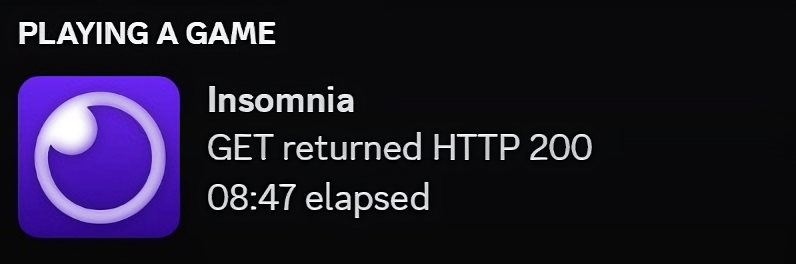

# Discord RPC for Insomnia

This is a plugin for [Insomnia](https://insomnia.rest/) that enables Discord Rich Presence. It shows your current activity in Insomnia on your Discord status.

## Features

-   Shows the current request method and endpoint in your Discord status.
-   Updates the status when a request is made.

## Installation

1. Open Insomnia.
2. `Preferences` > `Plugins` > `Reveal Plugins Folder`
3. Open a terminal in your plugins folder
4. Clone the repo `git clone git@github.com:notjawad/insomnia-plugin-drpc.git`
5. Click `Reload Plugins`

## Usage

Once the plugin is installed, it will automatically update your Discord status when you make a request in Insomnia.

## Dependencies

-   [discord-rpc](https://www.npmjs.com/package/discord-rpc)
